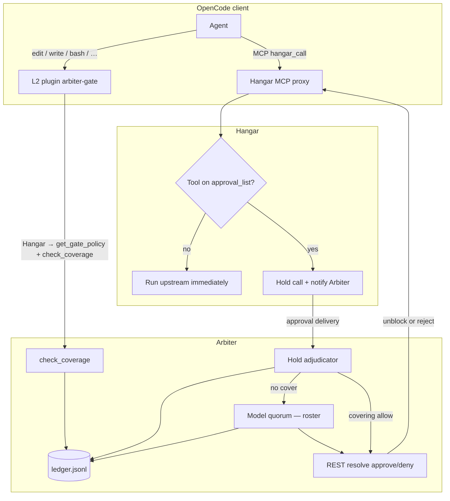
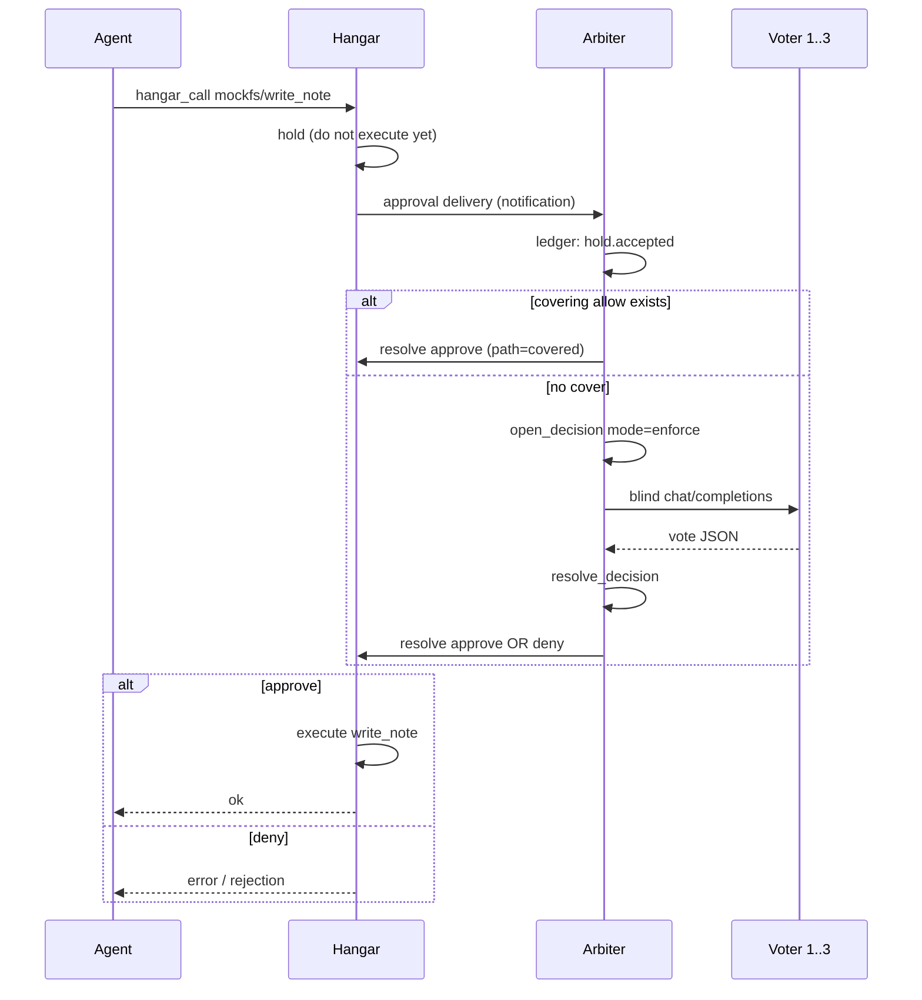

# How Arbiter works — onboarding map

This document explains **why** Arbiter exists and **how a request flows**,
without walking every historical stage. After reading it you should be able to
point to: who owns the tool, who votes, and where the verdict lives.

---

## 1. Problem in one sentence

An agent (for example OpenCode) can edit files and call MCP tools.
We do **not** trust it alone for sensitive actions — we want a separate,
repeatable *allow / deny* verdict before execution.

Arbiter = **decision gateway** + **append-only ledger**.
It does **not** edit the repo and does **not** run user tools itself.
It only: opens a decision → collects votes → records the outcome → (with Hangar)
returns approve / deny.

---

## 2. Roles

| Role | Does | Does **not** |
|------|------|----------------|
| **OpenCode (agent)** | Plans work, calls tools | Own criticality rules |
| **L2 plugin (`arbiter-gate`)** | Before `edit` / `bash` / … asks Arbiter for coverage (via Hangar when configured) | Embed local criticality policy |
| **Hangar** | MCP proxy; holds tools on `approval_list` | Vote by itself |
| **Arbiter** | Ledger, quorum, coverage, resolve back to Hangar | Give voters repo access |
| **Voters (1–7 models)** | JSON allow/deny on a blind evidence bundle | Tools or network beyond chat API |
| **Ledger `ledger.jsonl`** | Append-only event history | In-place “fix” of an old vote |

**Golden rule:** “is this path critical?” lives **only** in Arbiter’s
`arbiter.rules.yaml`. Clients never copy those rules.

---

## 3. Two gates (not one pipeline)

In practice there are **two independent entries**. Both end at Arbiter, but
differently.



### Path A — built-in tools (files / shell)

1. The agent wants `edit` / `apply_patch` / `bash` (deep demo: nearly everything
   except read-only when `ARBITER_GATE_ALL=1`).
2. With `HANGAR_URL` + `HANGAR_API_KEY`, the plugin calls the **injected Arbiter
   MCP** through Hangar (`arbiter hangar-call` under the hood): `get_gate_policy`,
   then `check_coverage`. Without Hangar it falls back to CLI
   `arbiter check-coverage` against `ARBITER_DATA_DIR`.
3. Arbiter checks for a **resolved** `allow` / `allow_narrow` whose **scope**
   covers those paths and has not expired.
   Absolute client paths (e.g. `/tmp/…/auth/handler.py`) match project-relative
   scope patterns such as `auth/**`.
4. No cover → plugin throws `ARBITER_PLAN_REQUIRED` (per `client_gate.plan.mode`).
   The agent must call Hangar → `ensure_plan` with a structured plan
   (`goal`, `steps`, `scope` — Arbiter formulation applies; no universal
   `**/*`). That runs model quorum and writes a covering allow.
5. A later `check_coverage` after `ensure_plan` lets the tool through.
   Coverage itself does **not** call the voter roster on every edit — only plan /
   hold paths do.

> OpenCode may surface the plugin throw as a generic “Patch failed”. Read the
> error text for `ARBITER_PLAN_REQUIRED`.

### Path B — MCP tool via Hangar

1. Agent calls e.g. `hangar_call` → `mockfs/write_note`
   (in OpenCode the tool id looks like `hangar_hangar_call` — see README).
2. Hangar sees the tool on `approval_list` → **holds** execution.
3. Arbiter’s delivery adapter receives the hold:
   - try **coverage** first,
   - else open allow/deny and run **model quorum**,
   - then `POST /approvals/{id}/resolve` (approve or deny).
4. Only after approve does Hangar run the real upstream tool.
5. In **enforce** mode, quorum deny means the tool **does not** run.
   In **shadow**, quorum is ledgered but the call still proceeds (evaluation).

---

## 4. What a “decision” and “quorum” are

Think of a ticket with a closed answer set:

```text
Question: Allow this action?
Options:  allow | deny
Voters:   ids from arbiter.voters.yaml (1–7; example uses voter-1..3)
Scope:    e.g. auth/** , src/**      (what the allow covers)
```

Flow:

1. `open_decision` — ledger row + evidence bundle.
2. `run_model_quorum` (or automatic on hold / `ensure_plan`):
   - round 1 **blind** — same prompt, no peer votes;
   - optional round 2 **reveal** — anonymous labels A, B, … (one per roster slot).
3. `resolve_decision` — apply the threshold:
   - **critical**: everyone must vote the **same** option;
   - **routine**: everyone votes + strict majority of the roster.
4. Missing vote (timeout, bad JSON) ≈ no vote → usually **deny**.

Voters get **no** tools and **no** repo — only HTTP `chat/completions`.

---

## 5. Repository layout

```text
arbiter/                 # package (hexagon: domain / application / adapters)
client/opencode/         # L2 plugin + permissions template
docs/                    # tutorial, how-it-works
docs/cookbooks/          # task guides (Podman, layers, Hangar, …)
deploy/podman/           # preferred container demo
scripts/live-smoke-up.sh # host-process demo under /tmp/arbiter-live
tests/                   # pytest (offline + integration)
*.yaml.example           # rules / voters / intercept templates
```

**Podman demo** (after `./deploy/podman/up.sh`) lives outside git:

```text
/tmp/arbiter-podman/
  env.sh                 # secrets + PATH — source before anything
  decisions/             # Hangar/Arbiter shared ledger volume
  project/               # OpenCode workspace + plugin + AGENTS.md
```

---

## 6. One hold timeline (enforce)



Typical ledger order:

`hold.accepted` → `decision.opened` → `vote.cast`×N → `baseline.verdict`
(optional) → `decision.resolved` → `hold.adjudicated`

```bash
source /tmp/arbiter-podman/env.sh
# ledger path depends on stack; Podman often via:
podman exec arbiter-hangar-1 tail -n 20 /data/decisions/ledger.jsonl | jq -c .
```

---

## 7. Fail-closed — day-to-day meaning

| Situation | Outcome |
|-----------|---------|
| Arbiter down / plugin cannot parse reply | **deny** |
| No covering allow on a critical path | **deny** |
| Voter timeout / bad reply | no vote → usually **deny** |
| MCP tool not on `approval_list` | Hangar **does not** ask Arbiter (passthrough) |
| `shadow_mode: true` | quorum in ledger, hold still approved |
| `ARBITER_BREAK_GLASS=1` | emergency allow + ledger event (never invisible) |

---

## 8. What Arbiter deliberately does not do

- Act as a “smart aggregator” that decides after hearing others
- Give models a shell or git access
- Stream partial voting results (no early close)
- Replace CI — layer 3 (`verify-commit`) is a separate commit backstop

---

## 9. Practical next steps

1. Read this file and sketch path A vs path B on paper.
2. Bring up Podman: [cookbooks/podman.md](./cookbooks/podman.md)
   (`./deploy/podman/up.sh --reset`). Lab contract: [cookbooks/lab.md](./cookbooks/lab.md).
3. Host alternative: [cookbooks/live-smoke.md](./cookbooks/live-smoke.md).
4. Then: [cookbooks/client-layers.md](./cookbooks/client-layers.md) and the
   [tutorial](./tutorial.md).

When something “oddly passes”: check the ledger and `enforce` vs `shadow`
first, then whether the tool is on `approval_list`, then whether OpenCode was
started after `source env.sh` (plugin + `ARBITER_GATE_ALL`).
